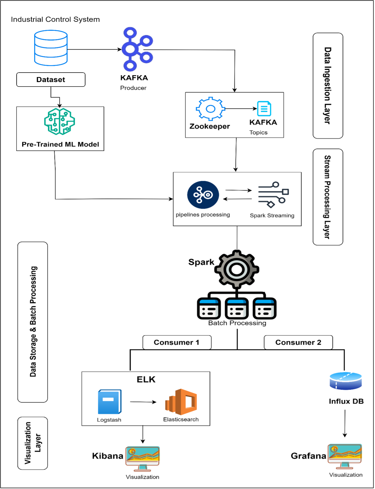

# OS_SM-Project
Open Source Technologies for Data Science &amp; Stream Mining  Project

# Real-Time Multimodal Anomaly Detection for Critical Infrastructures (RETIMU-AD)

## Project Overview
The **Real-Time Multimodal Anomaly Detection for Critical Infrastructures (RETIMU-AD)** project aims to enhance the security and resilience of critical infrastructure by detecting unusual or suspicious events in real time. By analyzing diverse data sources—such as images, logs, and audio—RETIMU-AD provides a comprehensive view of potential threats. 

### Key Features:
- **Multimodal Detection**: Combines multiple data types to address limitations of single-modality systems.
- **Real-Time Integration**: Offers immediate analysis to support high-stakes environments.
- **Advanced Technologies**: Utilizes CNNs, RNNs, and other cutting-edge models for enhanced detection accuracy.

---

## Project Objective
RETIMU-AD's primary objective is to fill the gap in real-time multimodal anomaly detection systems for critical infrastructures. The system employs:
- **Kafka** for data streaming.
- **Apache Spark** for real-time processing.
- **Python-based ML models** for anomaly detection.
- **InfluxDB** for time-series storage.
- **Grafana** for real-time visualization.

By integrating these technologies, stakeholders can monitor data flows, identify anomalies, and respond swiftly, ensuring enhanced security and operational resilience.

---

## System Architecture

### Data Ingestion Layer
- Collects raw data (sensor readings, logs, audio streams) via a **Kafka Producer**.
- Organizes data into specific **Kafka Topics** with **Zookeeper** for cluster management.
- Prepares structured, reliable pipelines for real-time processing.

### Pretrained Machine Learning Model
- Performs early-stage anomaly detection on ingested data.
- Flags significant deviations or patterns for further analysis in the **Stream Processing Layer**.

### Stream Processing Layer
- Processes data in real-time using **Spark Streaming**.
- Components include:
  - **Simple Moving Average (SMA) / Exponentially Weighted Moving Average (EMA)**: Tracks baseline trends.
  - **Error Rate-Based Change Detection**: Flags anomalies based on model prediction error rates.
  - **Real-Time Alerts**: Triggers immediate notifications.
  - **Data Logging to InfluxDB**: Stores anomaly metadata for historical analysis.
  - **Count-Based Detection**: Monitors event frequencies to flag spikes or dips.
  - **Time-Based Threshold Monitoring**: Flags deviations based on set thresholds.
  - **Rolling Window Standard Deviation**: Detects data fluctuation variability.
  - **Rule-Based Filters**: Flags straightforward anomalies like exceeding predefined thresholds.

### Data Storage & Batch Processing Layer
- Leverages **Spark Batch Processing** for in-depth historical data analysis.
- Key functions:
  - **Aggregation and Summary Statistics**: Analyzes historical data for trends.
  - **Histogram Analysis**: Identifies clusters or outliers.
  - **Rolling Window Average**: Tracks long-term trends.
  - **Basic Clustering (e.g., K-Means)**: Groups data to flag atypical patterns.

### Data Storage for Consumers
- **Consumer 1 (Logstash & Elasticsearch)**:
  - **Logstash** ingests and formats data for **Elasticsearch**.
  - Enables efficient search, storage, and analysis of logs.
- **Consumer 2 (InfluxDB)**:
  - Stores time-series data for quick retrieval and historical tracking.

### Visualization Layer
- **Kibana**: Visualizes Elasticsearch-indexed data for real-time anomaly detection.
- **Grafana**: Displays InfluxDB time-series data for historical trend analysis and proactive maintenance.

---

## Technologies Used
- **Kafka**: Real-time data ingestion and streaming.
- **Apache Spark**: Real-time and batch data processing.
- **InfluxDB**: Time-series data storage.
- **Elasticsearch**: Log storage and search.
- **Grafana & Kibana**: Visualization tools.
- **Python**: For ML model development.

---

## How to Use
...

---

## Contributors
- **Team ... **

---

## License
This project is licensed under the [MIT License](LICENSE).
